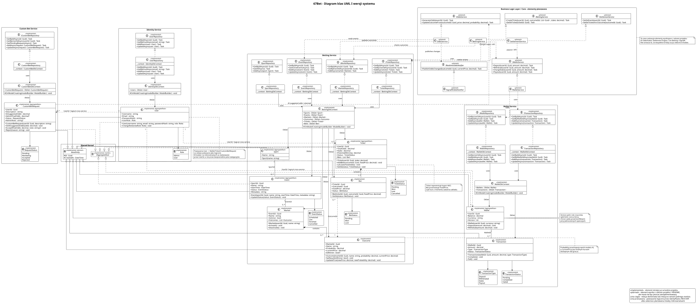

# 🎲 67Bet – AI-Driven Sports Betting Platform


Zaawansowany system do obsługi zakładów sportowych, symulujący rzeczywiste środowisko platformy bukmacherskiej. System wykorzystuje architekturę hybrydową, integrując przetwarzanie w czasie rzeczywistym (Real-time), spójność transakcyjną oraz modele sztucznej inteligencji oparte na ML.NET do dynamicznego wyznaczania kursów. Całość backendu napisana jest w 100% w C#.

---

## 📖 Opis, Cel i Idea Projektu

### 💡 Idea Systemu
Główną ideą stojącą za platformą **67Bet** jest zdefiniowanie na nowo sposobu, w jaki użytkownicy wchodzą w interakcję z systemami bukmacherskimi. Zamiast tworzyć kolejny, statyczny klon istniejących rozwiązań, aplikacja wprowadza inteligentne, wysoce responsywne środowisko napędzane algorytmami uczenia maszynowego (ML.NET). System zaciera granicę między tradycyjnym hazardem a rozwiązaniami społecznościowymi, dając graczom nie tylko możliwość obstawiania gotowych zdarzeń, ale również swobodę kreowania własnych, unikalnych rynków (Custom Bets). Całość została zaprojektowana tak, aby symulować w 100% profesjonalne, komercyjne środowisko o wysokiej dostępności.

### 🎯 Cel Projektu
Głównym celem inżynierskim jest zaprojektowanie, zaimplementowanie i przetestowanie wysoce skalowalnej architektury webowej w ekosystemie **.NET 10**, która sprosta wyzwaniom narzucanym przez systemy czasu rzeczywistego (Real-time). Aplikacja musi gwarantować absolutną spójność danych finansowych (ACID), bezopóźnieniową dystrybucję zmieniających się kursów (SignalR) oraz odporność na problemy współbieżności (np. jednoczesne postawienie tysięcy zakładów na to samo zdarzenie).
- 🛡️ **Role-Based Access Control (RBAC):** Dwuetapowy system uprawnień (Admin, User) wspierany przez nowoczesne API ASP.NET Core Identity.

---

## ✨ Kluczowe Funkcjonalności

System **67Bet** oferuje zaawansowane możliwości zarówno dla graczy, jak i administratorów, napędzane przez natywne rozwiązania AI.

### 👤 Panel Użytkownika (Gracz)
- **Zarządzanie Kontem:** Rejestracja, logowanie (ASP.NET Identity) oraz personalizacja profilu z pełną historią zakładów.
- **Transakcyjny Portfel (Wallet):** Bezpieczne wpłaty i wypłaty chronione przed wyścigami (*Optimistic Concurrency*) z natychmiastową aktualizacją salda.
- **Zaawansowane Obstawianie:**
    - **Kupony Multi-Bet (AKO):** Możliwość łączenia wielu zdarzeń w jeden kupon z automatycznym przeliczaniem kursu skumulowanego.
    - **Live Betting:** Obstawianie w czasie rzeczywistym dzięki WebSockets (SignalR).
- **Custom Bet Request:** Unikalna funkcja zgłaszania własnych propozycji zakładów do indywidualnej wyceny przez model AI i akceptacji administratora.

### 🛡️ Panel Administratora
- **Zarządzanie Custom Betami:** Przeglądanie propozycji od graczy, akceptacja/odrzucanie i opcjonalna korekta kursów wygenerowanych przez AI.
- **Moderacja i Bezpieczeństwo:** System RBAC (Admin, User), blokowanie kont, monitorowanie limitów i wykrywanie podejrzanych wzorców zakładów.
- **Nadzór nad Ofertą:** Dynamiczne otwieranie i zamykanie rynków, ręczne wprowadzanie wyników zdarzeń oraz funkcja *Manual Override* dla kursów.
- **Analityka Biznesowa:** Monitorowanie marży, obrotu (GGR) oraz skuteczności predykcyjnej modeli ML.NET.
### ⚙️ Silnik Systemowy (Core)
- 🧠 **Native AI Oddsmaker:** Autonomiczne generowanie kursów w oparciu o modele ML.NET trenowane na danych historycznych.
- ⚡ **Real-time Engine:** Błyskawiczna dystrybucja zmian kursów bez konieczności przeładowywania strony (SignalR).
- 🤖 **Settlement Engine:** Automatyczny system rozliczania tysięcy kuponów w ułamku sekundy po zatwierdzeniu wyniku zdarzenia.

---

## 🏗️ Architektura i Stos Technologiczny

### Architektura Systemu: 
Mikroserwisy w oparciu o zasady **Clean Architecture**. Zastosowanie jednolitego stosu technologicznego dla całego backendu eliminuje wąskie gardła komunikacyjne między mikroserwisami.

Zdecydowano się na architekturę mikroserwisową, aby zapewnić skalowalność i separację odpowiedzialności poszczególnych modułów systemu bukmacherskiego.

Podział na usługi: System zostanie podzielony na niezależne serwisy (np. IdentityService, BettingService, OddsService, WalletService).

Technologie: Każdy mikroserwis oparty jest na .NET 10 z niezależną instancją bazy PostgreSQL.

Komunikacja: Asynchroniczna wymiana danych przez REST API.

### Środowisko i Narzędzia AI
IDE: Visual Studio Code.

Agent AI: Cline (autonomiczny agent wewnątrz VS Code).

Model językowy: Google Gemini (podpięty przez API Key), wybrany ze względu na ogromne okno kontekstowe, pozwalające na analizę rozproszonej struktury mikroserwisów.

Metodologia pracy: AI-Driven Development (AIDD)
Praca nad systemem odbywa się w paradygmacie Human-in-the-loop, gdzie programista pełni rolę architekta i kontrolera jakości.

Prompt Engineering (Chain-of-Thought): Logika biznesowa nie jest generowana "jednym strzałem". Złożone procesy, takie jak algorytm rozliczania kuponów wielokrotnych (AKO), są rozbijane na etapy:

Analiza wymagań przez AI.

Przygotowanie pseudokodu/kroków logicznych.

Implementacja kodu przez Cline po akceptacji logiki.

### Stos Technologiczny
- **Frontend:** React (TypeScript), Tailwind CSS, Redux Toolkit, SignalR Client.
- **Backend (Core & API):** .NET 10 (ASP.NET Core Web API), Entity Framework Core.
- **AI & Data Ingestion:** **ML.NET** zintegrowane w ramach .NET Worker Services. Własne modele ładujące dane historyczne i korygujące kursy na żywo, działające jako usługi w tle.
- **Baza Danych & Cache:** PostgreSQL 16+ (jako główne źródło prawdy z natywnym wsparciem JSONB), Redis (do buforowania aktywnych rynków i sesji).

---

## 🗄️ Model Danych (High-Level)

Baza danych PostgreSQL została zaprojektowana z myślą o elastyczności. Zamiast dedykowanych tabel dla każdego sportu, wykorzystano kolumnę `metadata` typu `JSONB` w tabeli `Events`. Rozdzielono również warstwę analityczną od rynkowej: tabela `Outcomes` przechowuje zarówno czyste prawdopodobieństwo z modelu ML.NET (`probability`), jak i finalny kurs dla gracza (`current_price`). Umożliwia to łatwe audytowanie skuteczności sztucznej inteligencji.

---

## 📐 Dokumentacja UML

W ramach dokumentacji projektowej pierwszej wersji systemu przygotowano diagramy opisujące strukturę systemu 67Bet.

Dokumentacja znajduje się w folderze `docs`.

Pliki dokumentacji:

- `docs/database_diagram.puml` — diagram struktury bazy danych
- `docs/domain_model.md` — opis modelu domenowego systemu
- `docs/class_diagram.puml` — pełny diagram klas UML obejmujący obecne oraz planowane elementy systemu

Diagram klas UML:



---

## 🚀 Uruchomienie lokalne (Development)

### Wymagania:
- [.NET 10 SDK](https://dotnet.microsoft.com/download)
- [Node.js 18+](https://nodejs.org/)
- [Docker & Docker Compose](https://www.docker.com/) (dla bazy danych i cache'u)

### Kroki instalacji:

1. **Sklonuj repozytorium:**
   ```bash
   git clone [https://github.com/TwojUsername/67Bet.git](https://github.com/TwojUsername/67Bet.git)
   cd 67Bet
