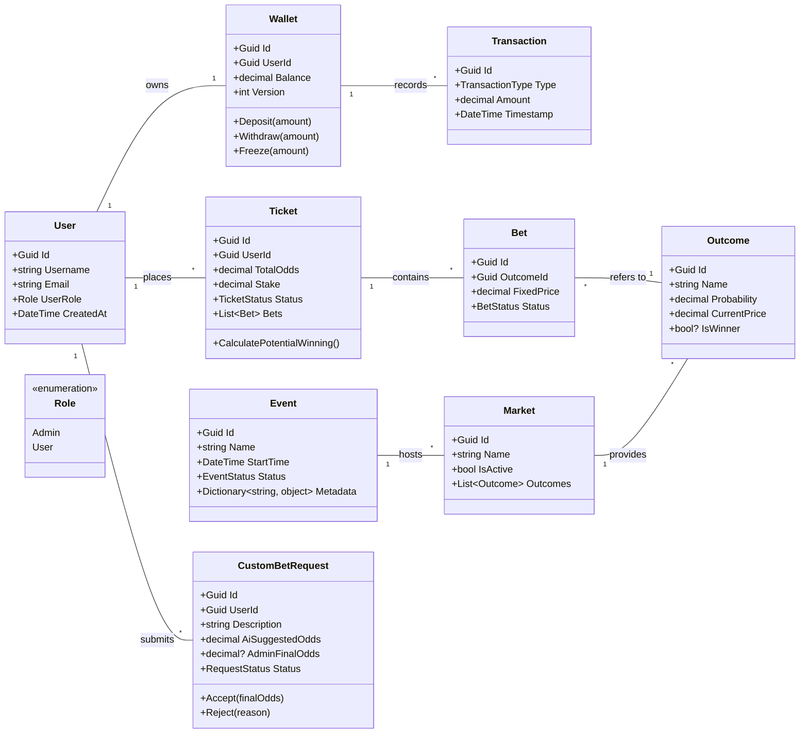

# 🧩 67Bet Domain Model

Diagram przedstawia strukturę obiektową systemu, z uwzględnieniem podziału na mikroserwisy i kluczowe agregaty.

### Kluczowe założenia modelu:

1.  **Wallet (Agregat Finansowy):** 
    *   Wykorzystuje `Version` do **Optimistic Concurrency**, co jest krytyczne przy szybkich zmianach salda.
    *   Metody `Freeze` i `Withdraw` są odseparowane, aby obsługiwać proces "zamrażania" środków pod aktywny kupon.

2.  **Ticket & Bet (Logika AKO):**
    *   `Ticket` to agregat nadrzędny. Sumuje kursy (`TotalOdds`) i zarządza statusem całego kuponu.
    *   `Bet` przechowuje `FixedPrice` (kurs z momentu postawienia), co chroni gracza przed zmianami kursów "na żywo" już po zawarciu zakładu.

3.  **Event (Polimorfizm przez Metadata):**
    *   Zamiast dziedziczenia klas dla każdego sportu, używamy `Dictionary/JSONB`, co pozwala na elastyczne dodawanie nowych dyscyplin (np. statystyki zawodników w MMA vs rzuty rożne w piłce).

4.  **CustomBetRequest:**
    *   Proces workflow: `Pending` (zgłoszony) -> `Reviewing` (AI wycenia) -> `Accepted/Rejected` (decyzja Admina).
